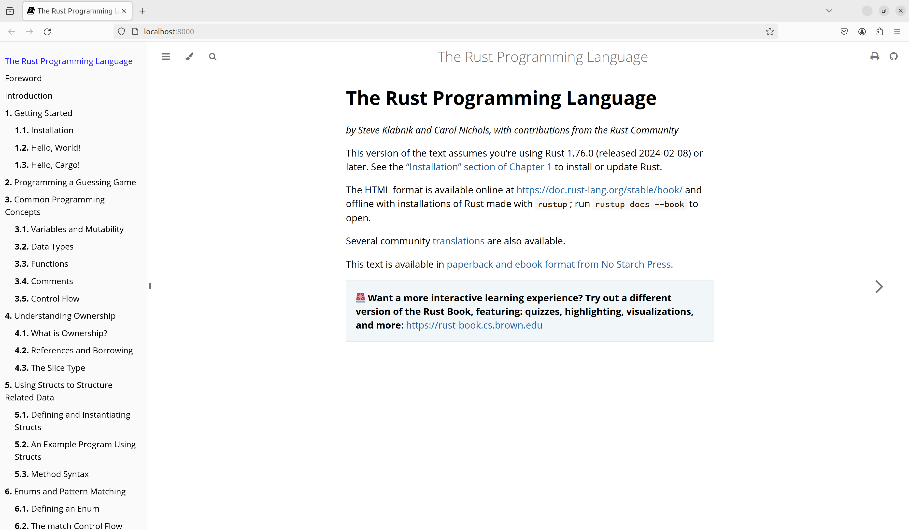

# Description
The included rustup doc does not work with Firefox browser so I created a small command line tool to view 
the html files in a browser:  
https://stackoverflow.com/questions/55961953/access-denied-when-i-run-rustup-doc

## Installation and Usage
Install go-rustup-doc using the following command.
```
go install github.com/JohnTT/go-rustup-doc@latest
```

Run the following command to see all possible arguments.
```
jchen@jchen-desktop:~/workspaces/go-rustup-doc$ go-rustup-doc --help
Usage of go-rustup-doc:
  -alloc
    	The Rust core allocation and collections library
  -book
    	The Rust Programming Language book
  -cargo
    	The Cargo Book
  -core
    	The Rust Core Library
  -edition-guide
    	The Rust Edition Guide
  -embedded-book
    	The Embedded Rust Book
  -nomicon
    	The Dark Arts of Advanced and Unsafe Rust Programming
  -proc_macro
    	A support library for macro authors when defining new macros
  -reference
    	The Rust Reference
  -rust-by-example
    	A collection of runnable examples that illustrate various Rust concepts and standard libraries
  -rustc
    	The compiler for the Rust programming language
  -rustdoc
    	Documentation generator for Rust projects
  -std
    	Standard library API documentation
  -test
    	Support code for rustc's built in unit-test and micro-benchmarking framework
  -toolchain string
    	Toolchain name, such as 'stable', 'nightly', or '1.8.0'
  -unstable-book
    	The Unstable Book
```

## Viewing the documentation
Run the following command to view `The Rust Programming Language book`.
```
jchen@jchen-desktop:~/workspaces/go-rustup-doc$ go-rustup-doc --book
2024/05/22 22:59:17 Running command '/home/jchen/.cargo/bin/rustup doc --book --path'
2024/05/22 22:59:17 Output '/home/jchen/.rustup/toolchains/stable-x86_64-unknown-linux-gnu/share/doc/rust/html/book/index.html'
2024/05/22 22:59:17 Running command '/usr/bin/xdg-open http://localhost:8000'
2024/05/22 22:59:17 Starting server on :8000...
```

The browser window should open automatically as shown in the screenshot below.  
Note: When opening different books, you may need to do a hard refresh (bypass cache) with Ctrl+Shift+R to view the
correct page.


